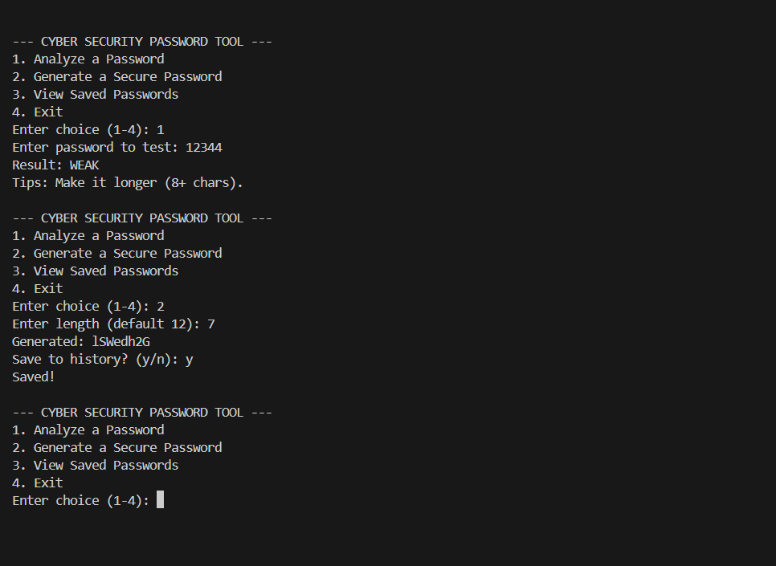

# Secure Password Strength Analyzer

## Overview
A Python-based cybersecurity tool that analyzes password strength and generates secure credentials.

## Features
* **Strength Check:** Tells you if a password is Weak, Medium, or Strong.
* **Generator:** Creates random, hard-to-guess passwords.
* **Vault:** Saves your history to a local text file.

## How to Run
1. Download the files.
2. Run `python main.py` in your terminal.

## Screenshots

